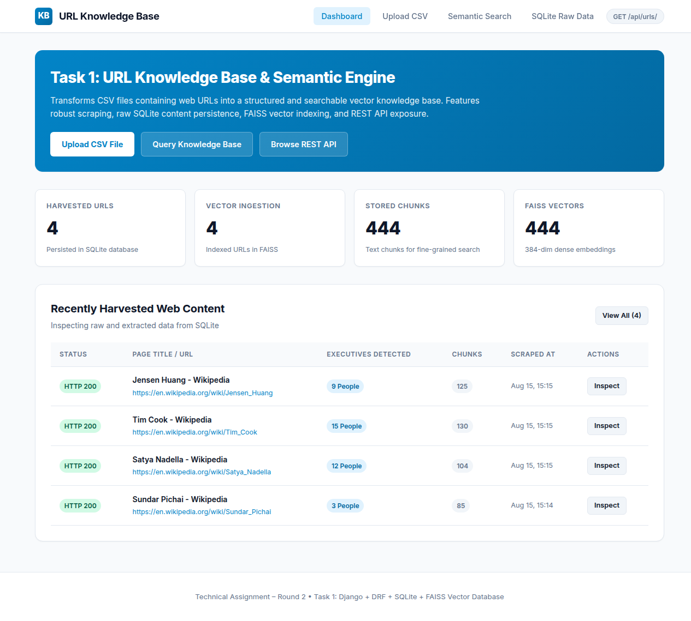
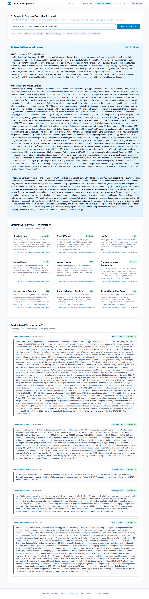
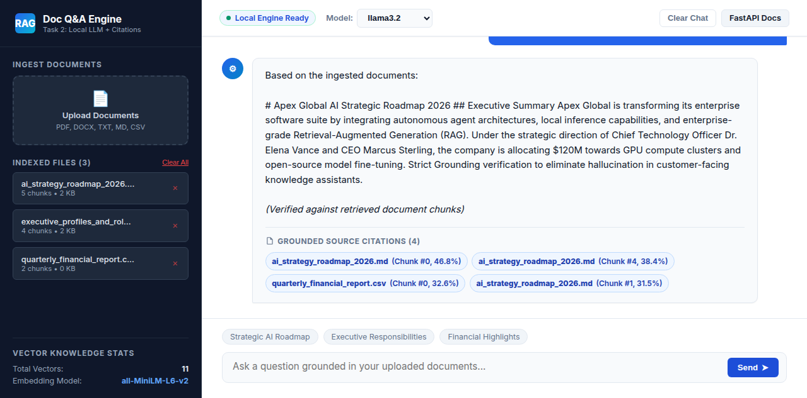
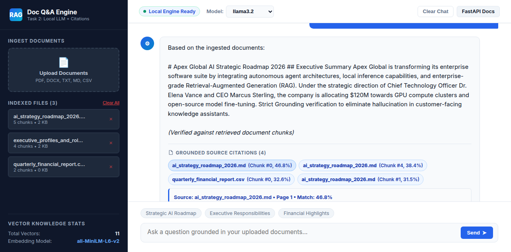
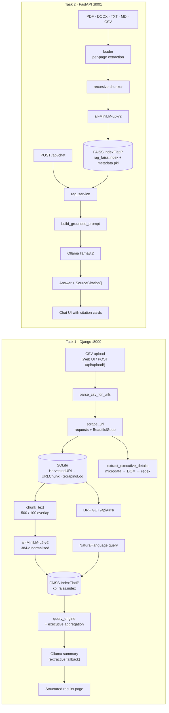

# Technical Assignment – Round 2

**Task 1** — Knowledge Base from CSV URLs (Django + DRF + SQLite + FAISS)
**Task 2** — Local LLM Document Q&A Chatbot (FastAPI + Ollama + FAISS, grounded RAG with citations)

[](https://www.python.org/)
[](https://www.djangoproject.com/)
[](https://www.django-rest-framework.org/)
[](https://fastapi.tiangolo.com/)
[](https://github.com/facebookresearch/faiss)
[-black)](https://ollama.com/)
[](#7-testing)

**Candidate:** Sakthikumar · **Repository:** <https://github.com/SakthiKumarSK/technical_assignment_round2>

---

## Table of Contents

1. [What this repository delivers](#1-what-this-repository-delivers)
2. [Requirement traceability](#2-requirement-traceability)
3. [Quickstart](#3-quickstart)
4. [Architecture](#4-architecture)
5. [API reference](#5-api-reference)
6. [Regenerating the vector stores (ingestion scripts)](#6-regenerating-the-vector-stores-ingestion-scripts)
7. [Testing](#7-testing)
8. [Design decisions and trade-offs](#8-design-decisions-and-trade-offs)
9. [Known limitations and next steps](#9-known-limitations-and-next-steps)
10. [Project structure](#10-project-structure)
11. [Troubleshooting](#11-troubleshooting)
12. [Documentation index](#12-documentation-index)

---

## 1. What this repository delivers

Two independent, fully local applications in one monorepo. Neither one calls a paid or hosted API; everything runs on the machine that clones this repo.

**Task 1 – URL Knowledge Base.** Upload a CSV of URLs through the browser. The backend parses the CSV (any column layout), scrapes each URL, persists the raw HTML plus HTTP status code and response metadata in SQLite, extracts person/executive entities from the markup, chunks the cleaned text, embeds each chunk with `all-MiniLM-L6-v2`, and stores the vectors in a FAISS index. A natural-language search page then runs semantic retrieval over that index and renders structured results (matched executives, roles, bios, source URL, similarity score), summarised by a local LLM when Ollama is running. Harvested records are exposed over `GET /api/urls/` via Django REST Framework.

| Task 1 dashboard | Task 1 semantic search |
|---|---|
|  |  |

**Task 2 – Grounded RAG chatbot.** Drop PDF/DOCX/TXT/MD/CSV files into the chat UI. Each document is parsed page by page, split by a recursive character splitter, embedded, and indexed in a persistent FAISS store. Questions are answered by a locally hosted Ollama model using a strict grounding prompt, and every answer ships with expandable source citations (document name, page, chunk index, similarity percentage, verbatim snippet). If the answer is not in the retrieved context the model is instructed to say so rather than guess.

| Task 2 grounded answer | Task 2 expanded citation |
|---|---|
|  |  |

All ten screenshots (upload, SQLite inspector, URL detail, DRF browsable API, Swagger, health) are in [`docs/screenshots/`](docs/screenshots/).

---

## 2. Requirement traceability

Every requirement from the assignment brief, mapped to the code that implements it and the test that proves it.

### Task 1 – Knowledge Base from CSV URLs

| # | Requirement | Implementation | Proof |
|---|---|---|---|
| 1.1 | Web interface to upload a CSV of URLs | `harvester/views.py::upload_view`, `templates/upload.html` (drag-and-drop + paste box) | `GET /upload/` |
| 1.2 | Parse the uploaded CSV | `harvester/scraper.py::parse_csv_for_urls` — column-agnostic, falls back to regex over the raw text | `tests/test_scraper.py` |
| 1.3 | Harvest/scrape content from each URL | `harvester/scraper.py::scrape_url` — retries-safe `requests` call, browser User-Agent, redirect tracking, per-URL error capture | `tests/test_scraper.py` |
| 1.4 | Store raw scraped content in SQLite | `harvester.models.HarvestedURL.raw_content` (+ `http_status_code`, `metadata_json`, `cleaned_text`, `executive_details`); audit trail in `ScrapingLog` | `tests/test_api.py` |
| 1.5 | Pipeline: SQLite → embeddings → vector DB | `harvester/vector_db.py::FAISSKnowledgeBase.ingest_url` / `ingest_all_unindexed`; runs automatically on upload, also on demand via `POST /api/ingest/` | `tests/test_vector_db.py` |
| 1.6 | Vector DB (Milvus **or** FAISS) | FAISS `IndexFlatIP` over L2-normalised 384-d vectors (= cosine similarity), persisted to `vector_data/kb_faiss.index` | `tests/test_vector_db.py` |
| 1.7 | Natural-language query UI + semantic search | `harvester/views.py::search_view`, `templates/search.html`, `harvester/query_engine.py::execute_semantic_query` | `GET /search/?q=...` |
| 1.8 | Retrieve **person-related** info (executives, roles, bios) | 3-tier extractor in `scraper.py::extract_executive_details` (schema.org microdata → semantic DOM classes → role regex), aggregated and de-duplicated per query in `query_engine.py` | `tests/test_scraper.py` |
| 1.9 | Chunk-based / structured retrieval | `vector_db.py::chunk_text` (paragraph-aware, 500 chars, 100 overlap); every chunk is a row in `URLChunk` with its `vector_id` | `tests/test_vector_db.py` |
| 1.10 | Structured results rendered **using a local/free LLM** | `query_engine.py::try_ollama_summarize` (Ollama `POST /api/generate`) with a deterministic extractive synthesiser fallback so the page never breaks when the daemon is off | `tests/test_api.py::test_post_api_search` |
| 1.11 | REST API `GET /api/urls/` returning URL, HTTP status, raw HTML, metadata | `harvester/api_views.py::HarvestedURLListView` + `serializers.HarvestedURLSerializer`; paginated, filterable by `status_code`, `is_indexed`, `q` | `tests/test_api.py::test_get_api_urls_list` |
| 1.12 | Django + DRF preferred | Django 5.x, `rest_framework` in `INSTALLED_APPS`, all API views are DRF `APIView`/`ListAPIView` | `kb_project/settings.py` |

### Task 2 – Local LLM Document Q&A Chatbot (RAG)

| # | Requirement | Implementation | Proof |
|---|---|---|---|
| 2.1 | Open-source LLM hosted locally via Ollama | `app/ollama_client.py::OllamaClient` → `POST /api/generate`, `GET /api/tags`; base URL from `OLLAMA_BASE_URL` | `GET /api/health` |
| 2.2 | Runs completely locally | No hosted-API keys anywhere; embeddings run on-device, FAISS is a local file, Ollama is a local daemon | `docker/docker-compose.yml` bundles an `ollama` service |
| 2.3 | Document loading | `app/loader.py` — PDF (per-page via `pypdf`), DOCX, TXT, MD, CSV (row → readable key: value sentences) | `tests/test_loader.py` |
| 2.4 | Text chunking | `app/chunker.py::split_text_recursive` — recursive separator cascade (`\n\n`, `\n`, `. `, … ) with overlap, plus per-chunk metadata | `tests/test_chunker.py` |
| 2.5 | Embedding generation | `app/vector_store.py::get_task2_embedder` — `all-MiniLM-L6-v2`, `normalize_embeddings=True` | `tests/test_vector_store.py` |
| 2.6 | Local vector DB (ChromaDB **or** FAISS) | `app/vector_store.py::LocalVectorStore` — FAISS `IndexFlatIP`, pickled metadata sidecar, add/delete/clear with index rebuild | `tests/test_vector_store.py` |
| 2.7 | Semantic retrieval of most relevant chunks | `LocalVectorStore.similarity_search` (top-k, cosine) | `tests/test_vector_store.py` |
| 2.8 | Grounded response generation | `app/ollama_client.py::build_grounded_prompt` — explicit grounding rules, refuse-if-unsupported instruction, recent conversation history used for reference resolution only | `tests/test_rag_service.py` |
| 2.9 | Source citations for every answer | `app/models.py::SourceCitation` → document name, page, chunk index, similarity score + percentage, snippet; assembled in `app/rag_service.py` | `tests/test_rag_service.py` |
| 2.10 | FastAPI backend with chat APIs | `app/main.py` + `app/routers/{chat,documents,health}.py`; `POST /api/chat` and SSE `POST /api/chat/stream` return answer **and** sources | `tests/test_api.py` |
| 2.11 | Responsive web chat interface showing sources | `static/index.html`, `static/js/chat.js`, `static/css/chat.css` — upload drawer, model switcher, collapsible citation cards, health indicator | `GET /` |

### Submission requirements and bonus items

| Requirement | Status | Where |
|---|---|---|
| Complete source code | Done | this repository |
| README with setup and execution instructions | Done | this file, Section 3 |
| Requirements file | Done | `requirements.txt` (single consolidated file for both tasks) |
| Ingestion scripts / model-artifact regeneration | Done | `scripts/ingest_task1.py`, `scripts/ingest_task2.py`, Section 6 |
| Screenshots | Done | `docs/screenshots/` (10 PNG files) |
| Demo video | Pending | add Loom/Drive link in Section 3.5 before submitting |
| Additional documentation | Done | `docs/DOCUMENTATION.md`, `docs/ARCHITECTURE.md`, `docs/API_REFERENCE.md` |
| Bonus: Docker support | Done | `docker/Dockerfile.task1`, `docker/Dockerfile.task2`, `docker/docker-compose.yml` (incl. Ollama service) |
| Bonus: Automated testing | Done | 23 pytest cases, Section 7 |
| Bonus: Logging | Done | Django `LOGGING` config in `kb_project/settings.py`; `logging.basicConfig` in `app/main.py`; per-URL scrape audit rows in `ScrapingLog` |
| Bonus: Deployment | Done | container images + `gunicorn kb_project.wsgi` / `uvicorn app.main:app`, Section 3.4 |
| Bonus: Code quality / structure | Done | layered modules, PEP 8, docstrings on every module and public function, no cross-task coupling |

---

## 3. Quickstart

### Prerequisites

| Tool | Version | Notes |
|---|---|---|
| Python | 3.10 – 3.12 | 3.12 used for development |
| Ollama | latest | Optional but recommended. Without it both apps still work through their deterministic fallback synthesisers. |
| Docker + Compose v2 | optional | For the containerised path |

```bash
git clone https://github.com/SakthiKumarSK/technical_assignment_round2.git
cd technical_assignment_round2

python -m venv .venv
source .venv/bin/activate        # Windows: .venv\Scripts\activate
pip install -r requirements.txt
```

Optional, for real LLM generation instead of the fallback:

```bash
ollama pull llama3.2             # ~2 GB, the documented default
ollama serve                     # usually already running as a service
```

Everything here is deliberately CPU-light — no GPU is required at any point:

| Component | Footprint | Notes |
|---|---|---|
| Embeddings (`all-MiniLM-L6-v2`) | ~80 MB, 384-d | Runs on CPU, loaded once into a module-level singleton |
| Vector DB (FAISS `IndexFlatIP`) | a single file on disk | No server, no daemon |
| LLM (Ollama) | your choice | `llama3.2` (~2 GB) is the default; on a low-RAM laptop use `llama3.2:1b` (~1.3 GB), `qwen3:0.6b` (~500 MB) or `gemma3:270m` (~290 MB) |

```bash
# Minimal-footprint option
ollama pull gemma3:270m
DEFAULT_LLM_MODEL=gemma3:270m ./scripts/run_task2.sh
```

> Override the model anywhere with `DEFAULT_LLM_MODEL`, or pick any pulled model from the dropdown in the chat UI. With no daemon at all, both apps degrade to a deterministic extractive synthesiser and stay fully usable — the header badge and `GET /api/health` always tell you which engine answered.

### 3.1 Task 1 — URL Knowledge Base (port 8000)

```bash
./scripts/run_task1.sh           # Windows: scripts\run_task1.bat
```

The script applies migrations and then starts the dev server.

| Surface | URL |
|---|---|
| Dashboard | <http://127.0.0.1:8000/> |
| CSV upload | <http://127.0.0.1:8000/upload/> |
| Semantic search | <http://127.0.0.1:8000/search/> |
| SQLite inspector | <http://127.0.0.1:8000/urls/> |
| REST API | <http://127.0.0.1:8000/api/urls/> |
| Django admin | <http://127.0.0.1:8000/admin/> |

**60-second walkthrough:** open `/upload/` → drop `sample_data/executive_urls.csv` → wait for the harvest summary → open `/search/` → ask *“Who is the CEO of Google and what did he lead?”* → inspect the matched executives, chunk snippets and similarity scores → open `/api/urls/` to see the raw HTML and status codes that back those answers.

### 3.2 Task 2 — RAG Chatbot (port 8001)

```bash
./scripts/run_task2.sh           # Windows: scripts\run_task2.bat
```

| Surface | URL |
|---|---|
| Chat UI | <http://127.0.0.1:8001/> |
| Swagger UI | <http://127.0.0.1:8001/docs> |
| ReDoc | <http://127.0.0.1:8001/redoc> |
| Health | <http://127.0.0.1:8001/api/health> |

**60-second walkthrough:** open the upload drawer → add `sample_data/documents/*` → ask *“What are the 2026 AI roadmap priorities?”* → expand the citation cards under the answer → then ask something absent from the documents and confirm the bot refuses instead of hallucinating.

### 3.3 Docker

```bash
docker compose -f docker/docker-compose.yml up --build
docker compose -f docker/docker-compose.yml exec ollama ollama pull llama3.2
```

Task 1 on `:8000`, Task 2 on `:8001`, Ollama on `:11434`. Task 2 reaches the daemon at `http://ollama:11434` over the compose network; Task 1's SQLite file and FAISS index live in the mounted `vector_data/` volume.

### 3.4 Deployment

The dev servers are for the demo. For a real deployment both apps expose standard entrypoints:

```bash
gunicorn kb_project.wsgi:application --bind 0.0.0.0:8000 --workers 3   # from task1_knowledge_base/
uvicorn app.main:app --host 0.0.0.0 --port 8001 --workers 2            # from task2_rag_chatbot/
```

`kb_project/asgi.py` is also provided if an async server is preferred. Set `DJANGO_DEBUG=False`, a real `DJANGO_SECRET_KEY`, and a concrete `ALLOWED_HOSTS` list before exposing Task 1 publicly.

### 3.5 Demo video

| Recording | Link |
|---|---|
| Task 1 + Task 2 walkthrough with audio narration | _add Loom/Drive link before sending the submission email_ |

Screenshots of every screen are in [`docs/screenshots/`](docs/screenshots/) as a fallback.

---

## 4. Architecture



Full component diagrams, the SQLite schema and the request lifecycle are in [`docs/ARCHITECTURE.md`](docs/ARCHITECTURE.md).

---

## 5. API reference

### Task 1 (Django REST Framework, `http://127.0.0.1:8000`)

| Method | Endpoint | Purpose |
|---|---|---|
| `GET` | `/api/urls/` | **Primary requirement.** Harvested URLs with `url`, `http_status_code`, `raw_content`, `metadata_json`, `executive_details`, indexing state. Supports `?page=`, `?status_code=`, `?is_indexed=`, `?q=` |
| `GET` | `/api/urls/<id>/` | Single record with cleaned text and chunk detail |
| `POST` | `/api/upload/` | Multipart CSV upload → scrape → SQLite → FAISS |
| `POST` | `/api/harvest/` | Harvest an explicit JSON list of URLs |
| `POST` | `/api/ingest/` | Ingest every not-yet-indexed record into FAISS |
| `POST` | `/api/search/` | Semantic search + executive aggregation + LLM summary |
| `GET` | `/api/stats/` | URL / chunk / vector counts and index state |

```bash
curl "http://127.0.0.1:8000/api/urls/?status_code=200"
curl -F "file=@sample_data/executive_urls.csv" http://127.0.0.1:8000/api/upload/
curl -X POST http://127.0.0.1:8000/api/search/ \
     -H "Content-Type: application/json" \
     -d '{"query":"Who leads Microsoft?","top_k":5}'
```

### Task 2 (FastAPI, `http://127.0.0.1:8001`)

| Method | Endpoint | Purpose |
|---|---|---|
| `POST` | `/api/chat` | Question → grounded answer + citations + latency |
| `POST` | `/api/chat/stream` | Same, streamed over SSE (`citations` event first, then `token` events) |
| `POST` | `/api/documents/upload` | Multipart ingest of one or more documents |
| `GET` | `/api/documents` | List ingested documents |
| `DELETE` | `/api/documents/{doc_id}` | Delete a document and rebuild the index |
| `DELETE` | `/api/documents` | Clear the whole vector store |
| `GET` | `/api/health` | Ollama connectivity, model list, vector counts |
| `GET` | `/api/models` | Models available in the local daemon |

```bash
curl -F "files=@sample_data/documents/ai_strategy_roadmap_2026.md" \
     http://127.0.0.1:8001/api/documents/upload

curl -X POST http://127.0.0.1:8001/api/chat \
     -H "Content-Type: application/json" \
     -d '{"question":"What are the 2026 AI roadmap priorities?","top_k":4}'
```

Full request/response schemas with example payloads: [`docs/API_REFERENCE.md`](docs/API_REFERENCE.md).

---

## 6. Regenerating the vector stores (ingestion scripts)

The committed FAISS index files are small placeholders. Both stores rebuild from scratch, headlessly, with no web UI involved:

```bash
# Task 1: CSV → scrape → SQLite → FAISS
python scripts/ingest_task1.py --csv sample_data/executive_urls.csv --reset

# Task 2: documents directory → chunks → FAISS
python scripts/ingest_task2.py --dir sample_data/documents --clear

# Both in sequence
./scripts/ingest_all.sh          # Windows: scripts\ingest_all.bat
```

Each script prints per-item progress and a final summary of documents, chunks and vectors so the artifacts are auditable. `scripts/ingest_task1.py` applies Django migrations first, so it works on a fresh clone.

---

## 7. Testing

```bash
./scripts/run_all_tests.sh       # Windows: scripts\run_all_tests.bat

pytest task1_knowledge_base -v   # 11 tests
pytest task2_rag_chatbot -v      # 12 tests
```

| Suite | Covers |
|---|---|
| `task1_knowledge_base/tests/test_scraper.py` | CSV parsing across column layouts, HTML cleaning, executive extraction, failure handling |
| `task1_knowledge_base/tests/test_vector_db.py` | Chunking boundaries, embedding shape (384-d), ingest → search round trip (isolated in `tmp_path`) |
| `task1_knowledge_base/tests/test_api.py` | `GET /api/urls/` contract, detail view, `POST /api/search/`, `GET /api/stats/` |
| `task2_rag_chatbot/tests/test_loader.py` | TXT/MD/CSV/DOCX/PDF loaders and dispatcher |
| `task2_rag_chatbot/tests/test_chunker.py` | Recursive splitting, overlap, chunk metadata |
| `task2_rag_chatbot/tests/test_vector_store.py` | Add/list/delete/clear, index rebuild, similarity ranking |
| `task2_rag_chatbot/tests/test_rag_service.py` | Grounded prompt construction, citation assembly, refusal on empty context |
| `task2_rag_chatbot/tests/test_api.py` | Health, models, document upload, chat contract via ASGI transport |

Tests never require a running Ollama daemon: the client falls back to the deterministic local synthesiser, so the suite is reproducible in CI.

---

## 8. Design decisions and trade-offs

| Decision | Why | Trade-off accepted |
|---|---|---|
| **FAISS over Milvus/Chroma** | Zero-infrastructure, single file on disk, exact search, trivially reproducible on a reviewer's laptop | No server-side sharding or metadata filtering; would move to Milvus/pgvector beyond ~10⁶ vectors |
| **`IndexFlatIP` + L2-normalised vectors** | Exact cosine similarity, no training step, no recall loss from approximation | O(n) scan per query — fine at this scale, would need IVF/HNSW later |
| **`all-MiniLM-L6-v2` (384-d)** | ~80 MB, CPU-only, ~5× faster than `mpnet` with competitive quality | Lower ceiling on nuanced semantic matching than a large embedding model |
| **Separate Django and FastAPI services** | Task 1 is CRUD/ORM/admin-heavy where Django excels; Task 2 is async streaming where FastAPI excels; keeps the two deliverables independently reviewable | Two processes and two dependency surfaces instead of one |
| **Deterministic fallback synthesiser when Ollama is offline** | The demo and the test suite never hard-fail on a missing local daemon | The fallback is extractive, not generative, and is labelled as such in the response |
| **Synchronous scraping inside the request** | Simple, observable, adequate for the CSV sizes in scope, no broker to install | A large CSV blocks the request; Celery + Redis is the documented next step |
| **Strict grounding prompt with an explicit refusal instruction** | Hallucination is the main failure mode of a RAG demo; refusing is the correct behaviour | Occasionally over-refuses when a fact is present but phrased distantly from the query |
| **Raw HTML persisted verbatim** | The assignment asks for raw content, and it makes re-extraction possible without re-scraping | Larger SQLite file |

---

## 9. Known limitations and next steps

- **Scraping is synchronous and single-threaded.** Celery + Redis workers with per-domain rate limiting is the natural next step; JavaScript-rendered pages would need Playwright.
- **Retrieval is dense-only.** Adding BM25 with reciprocal-rank fusion plus a cross-encoder reranker (`bge-reranker-base`) would improve precision on acronyms and rare names.
- **No formal RAG evaluation harness.** A fixed question set scored for faithfulness / answer relevancy / context recall (RAGAS-style) is the highest-value addition and is what I would build next.
- **Executive extraction is heuristic.** It handles schema.org markup, common team-card DOM patterns and role regexes, but unusual layouts still slip through; an NER model would raise recall.
- **No authentication or rate limiting.** Both services are open by design for local review.
- **Chat history is used only for reference resolution,** not for query rewriting; a follow-up-question rewriter would improve multi-turn retrieval.

---

## 10. Project structure

```
technical_assignment_round2/
├── task1_knowledge_base/               # Task 1 · Django + DRF + SQLite + FAISS
│   ├── manage.py
│   ├── kb_project/                     # settings, urls, wsgi.py, asgi.py
│   ├── harvester/
│   │   ├── models.py                   # HarvestedURL · URLChunk · ScrapingLog
│   │   ├── scraper.py                  # CSV parsing, scraping, entity extraction
│   │   ├── vector_db.py                # chunking, embeddings, FAISS index
│   │   ├── query_engine.py             # semantic search + LLM synthesis
│   │   ├── api_views.py                # DRF endpoints (GET /api/urls/, …)
│   │   ├── serializers.py · views.py · admin.py · urls.py
│   │   └── migrations/
│   ├── templates/ · static/            # dashboard, upload, search, inspector
│   └── tests/                          # 11 pytest cases
│
├── task2_rag_chatbot/                  # Task 2 · FastAPI + Ollama + FAISS
│   ├── app/
│   │   ├── main.py                     # ASGI app, lifespan, static mount
│   │   ├── config.py · models.py       # settings and pydantic schemas
│   │   ├── loader.py · chunker.py      # ingestion pipeline
│   │   ├── vector_store.py             # persistent FAISS store
│   │   ├── ollama_client.py            # local LLM client + grounded prompt
│   │   ├── rag_service.py              # orchestration, citations, SSE
│   │   └── routers/                    # chat · documents · health
│   ├── static/                         # single-page chat UI
│   └── tests/                          # 12 pytest cases
│
├── sample_data/                        # ready-to-use CSVs and documents
├── scripts/                            # run · test · ingest (.sh and .bat)
├── docker/                             # Dockerfiles + compose (incl. Ollama)
├── docs/                               # DOCUMENTATION · ARCHITECTURE · API_REFERENCE · screenshots
├── requirements.txt
└── README.md
```

---

## 11. Troubleshooting

| Symptom | Cause | Fix |
|---|---|---|
| `no such table: harvester_harvestedurl` | Migrations not applied | `cd task1_knowledge_base && python manage.py migrate` (the run scripts do this automatically) |
| `ImproperlyConfigured: WSGI application … could not be loaded` | `kb_project/wsgi.py` missing | Present in this repo; make sure you are running from `task1_knowledge_base/` |
| Answers look extractive, `ollama_connected: false` | Ollama daemon not reachable | `ollama serve`, then `ollama pull llama3.2`; check `GET /api/health` |
| `model "llama3.2" not found` | Tag not pulled locally | `ollama pull llama3.2`, or select a model you do have in the UI dropdown |
| First query takes ~10 s | Embedding weights downloading/loading once | Subsequent queries are sub-second; the model is cached in a module-level singleton |
| Search returns nothing | Nothing indexed yet | Upload a CSV/document, or run the scripts in [§6](#6-regenerating-the-vector-stores-ingestion-scripts); verify with `GET /api/stats/` |
| `numpy` / `faiss` import error | `faiss-cpu` older than 1.9 pins `numpy<2` | Reinstall with the pinned `requirements.txt` (`faiss-cpu>=1.9.0`) |
| Compose warns about `version` | Obsolete Compose key | Already removed; use `docker compose`, not `docker-compose` |

---

## 12. Documentation index

| Document | Contents |
|---|---|
| [`docs/DOCUMENTATION.md`](docs/DOCUMENTATION.md) | Questions, assumptions, difficulties encountered and how they were solved, development time per task, **Other Observations** |
| [`docs/ARCHITECTURE.md`](docs/ARCHITECTURE.md) | Component and sequence diagrams, SQLite schema, vector-store layout |
| [`docs/API_REFERENCE.md`](docs/API_REFERENCE.md) | Every endpoint with `curl` examples and full JSON responses |
| [`docs/screenshots/`](docs/screenshots/) | Screenshots of each UI surface and API response |
| [`PLAN.md`](PLAN.md) | Implementation plan and delivery checklist |

---

*Submitted by Sakthikumar for Technical Assignment – Round 2. Written from scratch for this assessment; all libraries used are open source and listed in `requirements.txt`.*
