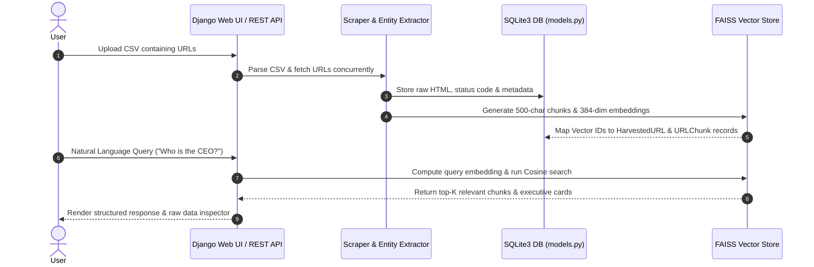
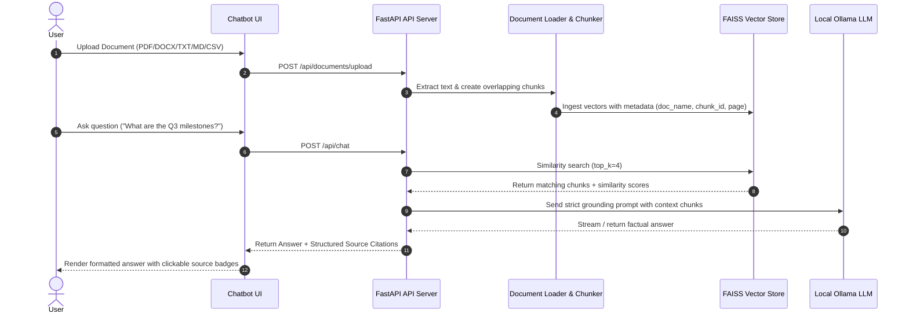

# System Architecture & Technical Specifications

## 1. High-Level Architecture Overview

```
                                  +-------------------------------------------------------------+
                                  |                    User Web Interfaces                     |
                                  |   (Task 1: URL KB Dashboard / Task 2: Grounded RAG Chat)    |
                                  +------------------------------+------------------------------+
                                                                 |
                                 +-------------------------------+-------------------------------+
                                 |                                                               |
                                 v                                                               v
                 +-------------------------------+                               +-------------------------------+
                 |  Task 1 Backend (Django / DRF)|                               |   Task 2 Backend (FastAPI)    |
                 +---------------+---------------+                               +---------------+---------------+
                                 |                                                               |
               +-----------------+-----------------+                           +-----------------+-----------------+
               |                                   |                           |                                   |
               v                                   v                           v                                   v
+-------------------------------+   +-----------------------------+   +-----------------------------+   +-----------------------------+
|    URL Scraper & Extractor    |   | SQLite Relational Database  |   |   Document Loader & Chunker |   |    Ollama Local LLM API     |
| (Requests + BeautifulSoup4)   |   |   (Raw HTML & Metadata)     |   | (PDF, DOCX, TXT, MD, CSV)   |   |  (Llama-3 / Mistral / Phi-3)|
+---------------+---------------+   +--------------+--------------+   +--------------+--------------+   +--------------+--------------+
                |                                  |                                 |                                 |
                +-----------------+----------------+                                 +-----------------+---------------+
                                  |                                                                    |
                                  v                                                                    v
                  +-------------------------------+                                    +-------------------------------+
                  |  Task 1 FAISS Vector Store    |                                    |   Task 2 FAISS Vector Store   |
                  | (384-dim Cosine IndexFlatIP)  |                                    | (384-dim Cosine IndexFlatIP)  |
                  +-------------------------------+                                    +-------------------------------+
```

---

## 2. Task 1: Pipeline & Data Flow



---

## 3. Task 2: Grounded RAG Pipeline



---

## 4. SQLite Schema (Task 1)

### `HarvestedURL` Table
| Column | Type | Description |
| :--- | :--- | :--- |
| `id` | BigAutoField (PK) | Unique URL identifier |
| `url` | URLField (2048) | Crawled target URL (Unique) |
| `http_status_code` | Integer | HTTP Response Code (e.g. 200, 404) |
| `raw_content` | TextField | Full raw HTML payload |
| `page_title` | CharField (512) | HTML `<title>` or OpenGraph title |
| `meta_description` | TextField | Meta description content |
| `cleaned_text` | TextField | Cleaned text extracted from DOM |
| `metadata_json` | JSONField | Response headers, content length, latency |
| `executive_details` | JSONField | Extracted persons, leadership roles & bios |
| `is_indexed` | Boolean | Whether vector embeddings are stored in FAISS |
| `total_chunks` | Integer | Total text chunks created |
| `created_at` | DateTimeField | Timestamp of harvesting |

### `URLChunk` Table
| Column | Type | Description |
| :--- | :--- | :--- |
| `id` | BigAutoField (PK) | Chunk primary key |
| `harvested_url_id` | ForeignKey | References `HarvestedURL.id` |
| `chunk_index` | Integer | Zero-based chunk position |
| `chunk_text` | TextField | 500-char semantic text chunk |
| `chunk_hash` | CharField (64) | SHA-256 hash for deduplication |
| `vector_id` | Integer | Corresponds to FAISS index vector index |
| `has_person_info` | Boolean | Flag for executive entity presence |
